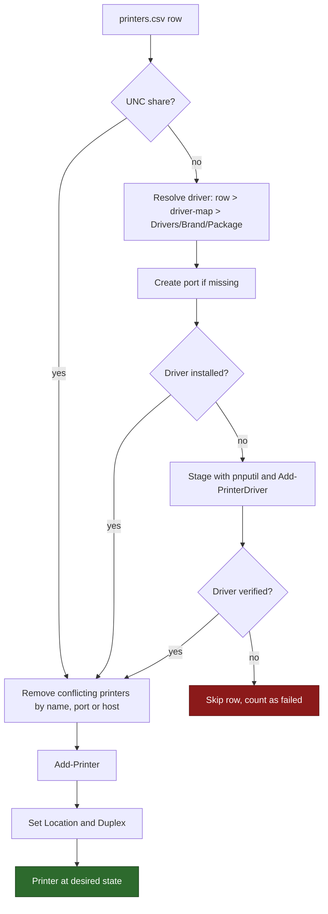

# PrinterFleetDeploy

<!-- BADGES:START -->
[](https://github.com/5a9awneh/PrinterFleetDeploy/actions/workflows/test.yml) [](LICENSE) [](https://github.com/5a9awneh/PrinterFleetDeploy/commits/main) [](https://microsoft.com/powershell) [](https://www.microsoft.com/windows) [](Tests) [](http://makeapullrequest.com) [](https://github.com/5a9awneh/PrinterFleetDeploy)
<!-- BADGES:END -->

Automated, robust, and enterprise-grade PowerShell automation suite for managing printers in Windows environments. Designed for System Administrators, IT Support, and DevOps to streamline bulk deployments, maintenance, diagnostics, and inventorying.

> **PrinterFleetDeploy**, by [Faris Khasawneh](https://github.com/5a9awneh), is a fork of [IamCarron/PrinterManagement](https://github.com/IamCarron/PrinterManagement)
> that adds transparent **driver auto-staging** (`pnputil /add-driver`) and **Location**
> (Building/Floor) wiring on top of the original bulk-deployment tool. It is brand/model/driver
> **agnostic** — bring your own inventory CSV, your own driver packages, and your own
> brand→driver map, and it works the same for any organization. See [Credits & Attribution](#-credits--attribution).

## 🖥️ Interactive Console

```text
  ===========================================================================
   ___  ___  ___  _  _  _____  ___  ___    ___  _     ___  ___  _____
  | _ \| _ \|_ _|| \| ||_   _|| __|| _ \  | __|| |   | __|| __||_   _|
  |  _/|   / | | | .` |  | |  | _| |   /  | _| | |__ | _| | _|   | |
  |_|  |_|_\|___||_|\_|  |_|  |___||_|_\  |_|  |____||___||___|  |_|
   ___   ___  ___  _      ___  __   __
  |   \ | __|| _ \| |    / _ \ \ \ / /
  | |) || _| |  _/| |__ | (_) | \ V /
  |___/ |___||_|  |____| \___/   |_|
  ===========================================================================
   v1.0.0 | Windows Printer Management Suite
   by Faris Khasawneh (github.com/5a9awneh)
   Based on IamCarron/PrinterManagement v3.2.0 (Apache-2.0)
  ===========================================================================

   >> OPERATIONS -------------------------------------------------
      [1]  Add Printers         Pick from CSV / TCP-IP / Shared UNC
      [2]  Remove Printers      CSV or interactive selection

   >> DIAGNOSTICS ------------------------------------------------
      [3]  Send Test Pages      CIM dispatch with printui fallback
      [4]  Clear Print Queue    Purge Spooler & restart service

   >> SYSTEM -----------------------------------------------------
      [5]  Inventory Printers   GUI table & CSV export
      [6]  View Activity Log    Review recent operations

   ---------------------------------------------------------------
      [0]  Exit

                         Made with <3 by Faris Khasawneh
```

---

## 📑 Table of Contents

- [PrinterFleetDeploy](#printerfleetdeploy)
  - [🖥️ Interactive Console](#️-interactive-console)
  - [📑 Table of Contents](#-table-of-contents)
  - [🌟 Features](#-features)
  - [📋 Requirements](#-requirements)
  - [🚀 Quick Start](#-quick-start)
    - [1. Clone the Repository](#1-clone-the-repository)
    - [2. Bring Your Own Data (never committed to git)](#2-bring-your-own-data-never-committed-to-git)
    - [3. Launch with Administrator Privileges](#3-launch-with-administrator-privileges)
  - [📊 CSV File Specifications](#-csv-file-specifications)
    - [Sample `printers.csv` (see `config/printers.sample.csv`):](#sample-printerscsv-see-configprinterssamplecsv)
  - [🔌 Driver Auto-Staging](#-driver-auto-staging)
  - [📍 Location Wiring](#-location-wiring)
  - [🔄 Duplex Printing](#-duplex-printing)
  - [🧪 Automated Unit Tests](#-automated-unit-tests)
    - [Running Tests Locally:](#running-tests-locally)
    - [Continuous Integration (CI):](#continuous-integration-ci)
  - [🛡️ Safety \& Parachute Guards](#️-safety--parachute-guards)
  - [🤝 Contributing](#-contributing)
  - [🙏 Credits \& Attribution](#-credits--attribution)
  - [📄 License](#-license)

---

## 🌟 Features

- ⚡ **Multi-Protocol Bulk Installation:** Deploy dozens of printers automatically from CSV files via standard TCP/IP (IPv4 / Hostname), Shared Network Printers (`\\server\share`), or Local Ports (`USB001`, `LPT1:`).
- 🗑️ **Dual-Mode Printer Removal:** Remove printers in bulk via CSV lists or interactively using a native Windows `Out-GridView` selection dialog with multi-select support (`Ctrl` / `Shift`).
- 📄 **Automated Test Page Dispatch:** Send hardware test prints via CIM/WMI methods (`Win32_Printer.PrintTestPage()`) with automatic fallback to native Windows `printui.dll`.
- 🧹 **Safe Spooler Queue Purge:** Stops the `Spooler` service cleanly, verifies process termination and file lock releases, clears corrupted print jobs (`.SHD` / `.SPL`), and restarts the Spooler service.
- 📊 **Real-Time Inventory & Console Table Inspection:** Collects system-wide printer data using modern CIM cmdlets, displays an organized, clean table directly in the terminal, and exports to UTF-8 CSV (`inventory.csv`).
- 🗂️ **Hybrid GUI / CLI File Picker:** Open native Windows Explorer dialogs by pressing `[Enter]` or type/paste file paths directly in the console.
- 🛡️ **Smart Delimiter & Header Parser:** Auto-detects delimiters (Semicolon `;`, Comma `,`, or Tab `\t`) and normalizes varied column names (`Driver`/`DriverName`, `Port`/`LocalPort`, `Name`/`PrinterName`).
- 📈 **Native Progress Bars:** Integrated `Write-Progress` tracking provides visual percentage and status updates during batch installations and test page dispatching.
- 📜 **Centralized Activity Logging:** Every operation, warning, success, and error is recorded with timestamps in `PrinterManagement.log`.
- 🌐 **Cross-PowerShell Compatibility:** 100% pure ASCII user interface and robust encoding protection, compatible with Windows PowerShell 5.1 and modern PowerShell 7+ (pwsh).
- 🔌 **Driver Auto-Staging:** Finds each printer's driver by convention (`Drivers/<Brand>/<Package>/`, name read from the `.inf`), with optional overrides in `config/driver-map.csv`, and stages it with `pnputil /add-driver ... /subdirs /install` when it isn't already installed.
- ✅ **Pick What To Act On:** Add Printers auto-detects `config/printers.csv` (Enter to accept, or type a path/`b` to browse) and shows a grid of its printers so you install only the ones you need. Send Test Pages and Remove Printers (option 2) show the printers actually installed on this machine (virtual PDF/OneNote/XPS printers hidden from test pages). Every grid is sorted by printer name and supports Ctrl/Shift multi-select. Scripted runs with `-FilePath` process every row; add `-Select` to get the picker there too.
- 📍 **Location Wiring:** Sets the Windows printer `Location` property from a `Location` column, or composes it from `Building`/`Floor` — and the `Remove-Printers` picker sorts by `Location` so a large fleet is easy to navigate visually.
- 🔄 **Reconcile-to-Desired-State:** Before adding a printer, removes any existing printer matching that row's `Name` **or** port (wrong driver already selected, stale entry under a different name, duplicates — all handled the same way) so the fresh install always succeeds, then re-adds it clean from the CSV.
- 💾 **Automatic Pre-Change Backup:** `Add-Printers` snapshots the current `Get-Printer`/`Get-PrinterPort`/`Get-PrinterDriver` state to a timestamped JSON file before making any changes, as a rollback reference.
- 🔄 **Default Duplex Printing:** Sets each printer's default print preference to two-sided (`TwoSidedLongEdge`) via `Set-PrintConfiguration` — driver-agnostic, works the same across brands — with a per-row `Duplex` column override (`ShortEdge`/`Simplex`) for exceptions like label printers.
- 🧪 **`-DryRun` Previews:** `Add-Printers -DryRun` previews every driver-staging, port-creation, printer-add, and Location-set action without changing anything on the system.

---

## 📋 Requirements

- **Operating System:** Windows 10 / 11 or Windows Server 2016 / 2019 / 2022 / 2025.
- **PowerShell Version:** Windows PowerShell 5.1 (Built-in) or PowerShell 7.x (Core).
- **Execution Privileges:** Elevated Administrator rights (`Run as Administrator`).
- **Print Drivers:** Put each vendor's extracted driver package under `Drivers/<Brand>/` and the tool stages it for you (see [Driver Auto-Staging](#-driver-auto-staging)).

---

## 🚀 Quick Start

### 1. Clone the Repository
```powershell
git clone <your-fork-url> PrinterFleetDeploy
cd PrinterFleetDeploy
```

### 2. Bring Your Own Data (never committed to git)
- Copy [`config/printers.sample.csv`](config/printers.sample.csv) to `config/printers.csv` and fill in your real inventory.
- Extract your vendors' driver packages to `Drivers/<Brand>/<Package>/` (the folder name matches the `Brand` column), see [`Drivers/README.md`](Drivers/README.md). Only add a `config/driver-map.csv` (from [the sample](config/driver-map.sample.csv)) for exceptions, see [Driver Auto-Staging](#-driver-auto-staging).
- All of the above are covered by `.gitignore` — real inventory and driver binaries never touch git history.

### 3. Launch with Administrator Privileges
Double-click **`RUN.cmd`** — it requests elevation via UAC and launches the script for you, no
manual "Run as Administrator" needed. This is the recommended way to hand the whole project
folder to a technician or run it on an end-user's machine.

Or, if you're at an already-elevated PowerShell prompt:
```powershell
.\PrinterManagement.ps1
```

---

## 📊 CSV File Specifications

The parser automatically detects delimiters (`;`, `,`, or `\t`) and tolerates a few common header
aliases (`Printer Name`/`PrinterName`/`Name`, `IP Address`/`Port`/`LocalPort`). Only `Name` and
`LocalPort` are required — every other column is optional and purely additive:

| Column | Required? | Purpose |
| :--- | :--- | :--- |
| **`Name`** | Yes | Display name for the printer in Windows. |
| **`LocalPort`** | Yes | Port identifier (IPv4 address, hostname, UNC path, or a `USB###` port). USB ports are created by Windows when the printer is plugged in, so the script never creates them: connect the printer first, and note the number (`USB001`, `USB002`...) can differ per machine. |
| **`Brand`** | No\* | Matched to `Drivers/<Brand>/` by convention (or an override row in `config/driver-map.csv`) to resolve the driver. |
| **`DriverName`** | No\* | Exact registered driver name (`Get-PrinterDriver`). Overrides the `Brand` lookup if present. |
| **`DriverFolder`** | No\* | Path under `Drivers/` to stage from if the driver isn't installed yet. Overrides the `Brand` lookup if present. |
| **`Model`** | No | Informational only — not used in any staging/install logic. |
| **`Building`** / **`Floor`** | No | Composed into the printer's Windows `Location` property (e.g. `Building HQ, Floor 2`). |
| **`Location`** | No | Freeform override, used verbatim instead of composing from `Building`/`Floor`. |
| **`Duplex`** | No | Default print preference. Blank = `TwoSidedLongEdge` (two-sided). `ShortEdge` or `Simplex`/`Off` per row for exceptions like label printers. |

\*At least one of `DriverName` **or** a `Brand` resolvable via `driver-map.csv` is needed for
driver auto-staging; if neither resolves, the printer add is skipped with a warning (or, if the
driver's already installed, staging is simply skipped and the add proceeds normally).

### Sample `printers.csv` (see [`config/printers.sample.csv`](config/printers.sample.csv)):
```csv
Printer name,IP Address,Brand,DriverName,Model,Building,Floor,Duplex
Reception - Ground Floor,10.10.1.10,Canon,,Canon imageFORCE 6160,HQ,0,
Finance - Shared (UNC),\\printserver01\Finance_Shared,,,,HQ,2,
Warehouse - Labels,USB001,,ZDesigner ZD420-203dpi ZPL,Zebra ZD420,Warehouse,0,Simplex
```

---

## 🔌 Driver Auto-Staging

**No configuration needed.** Put each vendor's extracted driver package at
`Drivers/<Brand>/<Package>/` and set the printer's `Brand` in `printers.csv`. The script finds
the folder (case-insensitive; characters illegal in folder names become `-`, so `Develop/KM`
maps to `Drivers/Develop-KM/`), reads the driver name from the package's `.inf` files, stages it
with `pnputil`, and registers it with the print spooler.

`config/driver-map.csv` is an **optional exceptions file** for the cases convention can't decide:
brand aliases, a brand folder holding several packages, or a package declaring many model names.
A row there always wins over convention (see
[`config/driver-map.sample.csv`](config/driver-map.sample.csv)):

```csv
Brand,DriverName,DriverFolder
Canon,Canon Generic Plus PCL6,Canon/GPlus_PCL6_Driver_V340_W64_00
```

- **`DriverName`** may be left blank; it is then read from the `.inf` when the package declares a
  single name (or one name plus versioned variants).
- **`DriverFolder`** is a path relative to `Drivers/`, the top-level extracted package folder. See
  [`Drivers/README.md`](Drivers/README.md) for layout and sourcing.
- A row's own `DriverName`/`DriverFolder` in `printers.csv` beats the map, which beats convention.
- When a driver isn't installed yet, `Add-Printers` runs
  `pnputil /add-driver "Drivers\<Folder>\*.inf" /subdirs /install` before creating the printer. Use
  `Add-Printers -DryRun` to preview without changing anything.
- **Expect a trust prompt and a slow driver or two.** Some publishers make Windows ask "install this
  driver software?" once per PC (a security gate that can't be automated; it may appear behind the
  console, so check there if a run seems frozen). Some drivers, such as HP's Universal Print Driver,
  can take about 2 minutes per `Add-Printer`. Wait and don't press Ctrl+C; if a run is interrupted,
  rerun it and the printer is recreated cleanly.

**How `Add-Printers` handles each CSV row:**



---

## 📍 Location Wiring

If a CSV row has a `Location` value, it's applied verbatim; otherwise, if it has `Building`
and/or `Floor`, those are composed into `"Building X, Floor Y"` (or just whichever of the two is
present) and set via `Set-Printer -Location`. This runs after a successful `Add-Printer` for both
shared/UNC and standard TCP/USB printers, and is purely additive — no-op when none of the three
columns are present.

The interactive picker in `Remove-Printers` (option `[2]`) also surfaces each installed printer's
`Location` as a column (sorted by name like every other grid), so you can see where each one lives
before removing it.

---

## 🔄 Duplex Printing

Every printer defaults to two-sided printing (`TwoSidedLongEdge`) via `Set-PrintConfiguration` —
this is a Print Spooler/Print Ticket setting, not something driver-specific, so it works
identically across brands. Add a `Duplex` column to override per row:

| Value | Result |
| :--- | :--- |
| *(blank)* | `TwoSidedLongEdge` (default) |
| `ShortEdge` | `TwoSidedShortEdge` (short-edge binding) |
| `Simplex` / `Off` | `OneSided` — use for devices with no physical duplexer, e.g. label printers |

Matching is case/whitespace-tolerant. An unrecognized value logs a warning and leaves the
driver's own default untouched; a device that can't honor the requested mode (no duplex
hardware) also just warns — it never fails the printer's install.

---

## 🧪 Automated Unit Tests

The repository includes a comprehensive unit and integration test suite built with **Pester 5+**
located in `Tests/`: the inherited baseline suite (`PrinterManagement.Tests.ps1`) plus
`DriverStaging.Tests.ps1`, which covers the driver-map resolution, auto-staging, and Location
wiring added by this fork — entirely via mocks, with no real `pnputil`/driver-store/`Set-Printer`
calls.

### Running Tests Locally:
```powershell
# Automated test runner (installs Pester automatically if not present, discovers all *.Tests.ps1):
.\Tests\Run-Tests.ps1

# Or run directly via Pester:
Invoke-Pester .\Tests\ -Output Detailed
```

### Continuous Integration (CI):
Automated testing is configured via **GitHub Actions** (`.github/workflows/test.yml`), verifying code quality and test execution across both **Windows PowerShell 5.1** and **PowerShell 7+ (pwsh)** on every push and pull request.

---

## 🛡️ Safety & Parachute Guards

- 🔁 **Reconcile, Don't Branch (know this before running):** `Add-Printers` removes any existing printer matching the CSV row's `Name` or port *before* re-adding it — intentionally, so a wrong driver, a stale different-named entry, or a duplicate all get cleaned up the same simple way instead of failing. This means it's destructive by design: pending jobs and any manually-tweaked settings on a matched printer are reset when it's recreated. A pre-change backup (below) is taken automatically so this is always recoverable.
- 💾 **Automatic Backup Before Changes:** Every real (non-`-DryRun`) `Add-Printers` run snapshots current printers/ports/drivers to a timestamped JSON file in `PrinterStateBackups/` first (the newest 10 are kept; the activity log rotates to `PrinterManagement.log.1` at 1 MB).
- 🪂 **Interactive Deletion Safeguards:** Removal operations require explicit confirmation (`Y/N`) before modifying the system unless `-Force` is supplied programmatically.
- 🔍 **Pre-Execution Driver Validation:** Verifies that the required printer driver exists locally before attempting printer creation, avoiding system errors or corrupt configurations.
- 🧹 **Controlled Spooler Restart:** Stops the print spooler safely and ensures all pending file handles are released before purging `.SPL` / `.SHD` spool files.
- 💉 **CIM / WQL Escape Protection:** Automatically escapes single quotes and special characters in printer names to prevent WMI/CIM injection and query errors.
- 📋 **Zero Pipeline Pollution:** All helper routines are isolated to guarantee pure data pipelines across scripts and test runners.

---

## 🤝 Contributing

Contributions, issues, and feature requests are welcome!

1. Fork the Project.
2. Create your Feature Branch (`git checkout -b feature/AmazingFeature`).
3. Commit your Changes (`git commit -m 'feat: add some amazing feature'`).
4. Push to the Branch (`git push origin feature/AmazingFeature`).
5. Open a Pull Request.

---

## 🙏 Credits & Attribution

This project is a fork of [**IamCarron/PrinterManagement**](https://github.com/IamCarron/PrinterManagement)
(Apache License 2.0) — all of the core bulk-install/remove, test-page dispatch, spooler-purge,
inventory, and CSV-parsing functionality originates there. This fork layers driver auto-staging
and Location wiring on top, kept additive and low-conflict with future
`git fetch upstream && git merge`. See [NOTICE.md](NOTICE.md) for the full attribution statement
required by the Apache License.

---

## 📄 License

Distributed under the **Apache License 2.0**. See the [LICENSE](LICENSE) file for more information.


